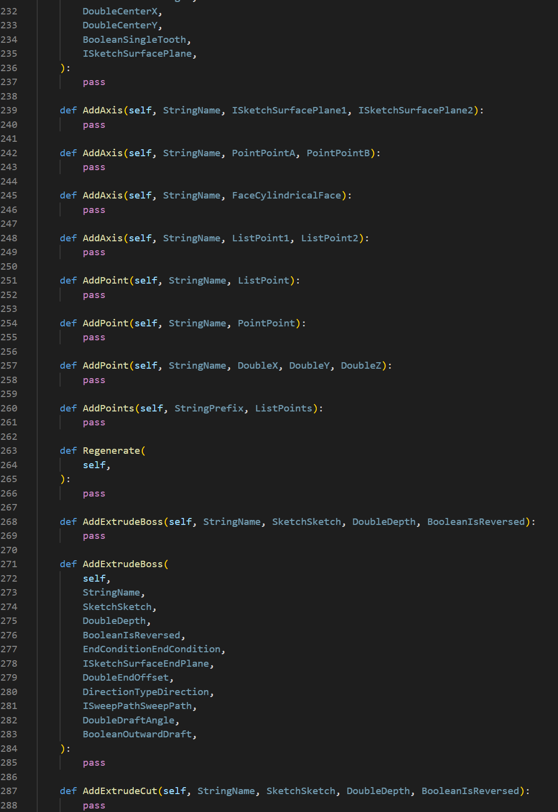

Alibre-Script.Reflected uses reflection of AlibreScriptAddOn.dll to generate the python source. Similar to the other stub files, it was made to help working with Alibre Script code outside of Alibre Design. This is another attempt at it.

Parameter information is included in the python source:



This can be useful as a reference when learning and programming Alibre Script, which is my primary use for it, along with the other stub files I've created.


```
│   AlibreScript.Reflected.code-workspace
│   generate.py
│   README.md
├───bin
│       AlibreScript.py
│       ex_0.py
│       ex_1.py
│       main.py
│       Notebook.ipynb
├───output
│       AssembledSubAssembly.py
│       Assembly.py
│       Axis.py
│       Bspline.py
│       Bspline3D.py
│       Circle.py
│       CircularArc.py
│       CircularArc3D.py
│       Configuration.py
│       CSharp.py
│       Edge.py
│       Ellipse.py
│       EllipticalArc.py
│       Face.py
│       Feature.py
│       GearSketch.py
│       GlobalParameters.py
│       IAssembled.py
│       IAxis.py
│       IChamferable.py
│       IConstrainable.py
│       ICrossSection.py
│       IFilletable.py
│       IInstance.py
│       IPlane.py
│       IPoint.py
│       ISelectableGeometry.py
│       ISketchFigure.py
│       ISketchFigure3D.py
│       ISketchSurface.py
│       ISweepPath.py
│       Line.py
│       Line3D.py
│       Material.py
│       Parameter.py
│       Part.py
│       Plane.py
│       Point.py
│       Polyline.py
│       Polyline3D.py
│       PolylinePoint.py
│       PolylinePoint3D.py
│       Sketch.py
│       Sketch3D.py
│       SketchPoint.py
│       SketchPoint3D.py
│       ThreeD.py
│       TwoD.py
│       Units.py
│       Vertex.py
│       Windows.py
├───sources
│       AlibreScript.API.AssembledSubAssembly.txt
│       AlibreScript.API.Assembly.txt
│       AlibreScript.API.Axis.txt
│       AlibreScript.API.Bspline.txt
│       AlibreScript.API.Bspline3D.txt
│       AlibreScript.API.Circle.txt
│       AlibreScript.API.CircularArc.txt
│       AlibreScript.API.CircularArc3D.txt
│       AlibreScript.API.Configuration.txt
│       AlibreScript.API.CSharp.txt
│       AlibreScript.API.Edge.txt
│       AlibreScript.API.Ellipse.txt
│       AlibreScript.API.EllipticalArc.txt
│       AlibreScript.API.Face.txt
│       AlibreScript.API.Feature.txt
│       AlibreScript.API.GearSketch.txt
│       AlibreScript.API.GlobalParameters.txt
│       AlibreScript.API.IAssembled.txt
│       AlibreScript.API.IAxis.txt
│       AlibreScript.API.IChamferable.txt
│       AlibreScript.API.IConstrainable.txt
│       AlibreScript.API.ICrossSection.txt
│       AlibreScript.API.IFilletable.txt
│       AlibreScript.API.IInstance.txt
│       AlibreScript.API.IPlane.txt
│       AlibreScript.API.IPoint.txt
│       AlibreScript.API.ISelectableGeometry.txt
│       AlibreScript.API.ISketchFigure.txt
│       AlibreScript.API.ISketchFigure3D.txt
│       AlibreScript.API.ISketchSurface.txt
│       AlibreScript.API.ISweepPath.txt
│       AlibreScript.API.Line.txt
│       AlibreScript.API.Line3D.txt
│       AlibreScript.API.Material.txt
│       AlibreScript.API.Parameter.txt
│       AlibreScript.API.Part.txt
│       AlibreScript.API.Plane.txt
│       AlibreScript.API.Point.txt
│       AlibreScript.API.Polyline.txt
│       AlibreScript.API.Polyline3D.txt
│       AlibreScript.API.PolylinePoint.txt
│       AlibreScript.API.PolylinePoint3D.txt
│       AlibreScript.API.Sketch.txt
│       AlibreScript.API.Sketch3D.txt
│       AlibreScript.API.SketchPoint.txt
│       AlibreScript.API.SketchPoint3D.txt
│       AlibreScript.API.ThreeD.txt
│       AlibreScript.API.TwoD.txt
│       AlibreScript.API.Units.txt
│       AlibreScript.API.Vertex.txt
│       AlibreScript.API.Windows.txt
└───test.packages
    ├───alibrescript_package
    │   │   setup.py
    │   │
    │   └───alibrescript_package
    │           AlibreScript.py
    │           __init__.py
    └───alibrescript_windows_package
        │   setup.py
        └───alibrescript_windows_package
                Windows.py
                __init__.py
```
